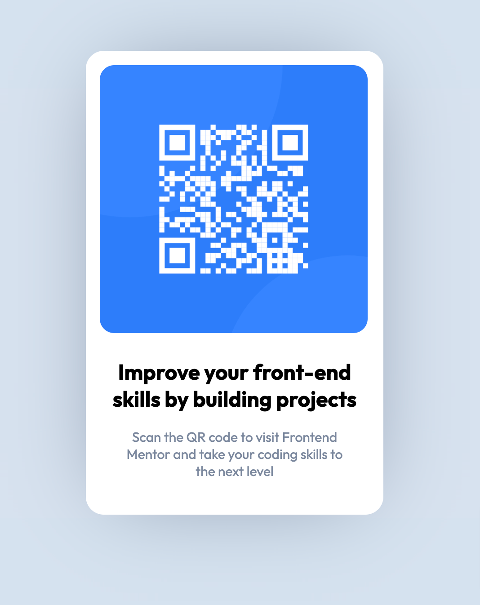

# Frontend Mentor - QR code component - Project

## Overview:

Duplicate the QR Code component per the design specs, style guide and provided images.

[Style Guide](./style-guide.md)

## Screenshot

See the link below for the final component screenshot

## Links

Hosted the final on Github pages, for ease of viewing

https://chrtravels.github.io/qr-code-component/

## My process

Simple layout with html/css, using flexbox for centering the component and component elements.
Media queries weren't necessary to have the image stay the necessary size for desktop & mobile

## Built with

- HTML/CSS
- Flexbox
